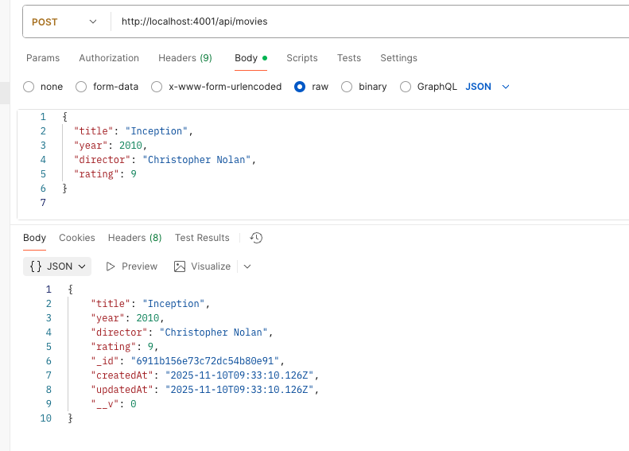
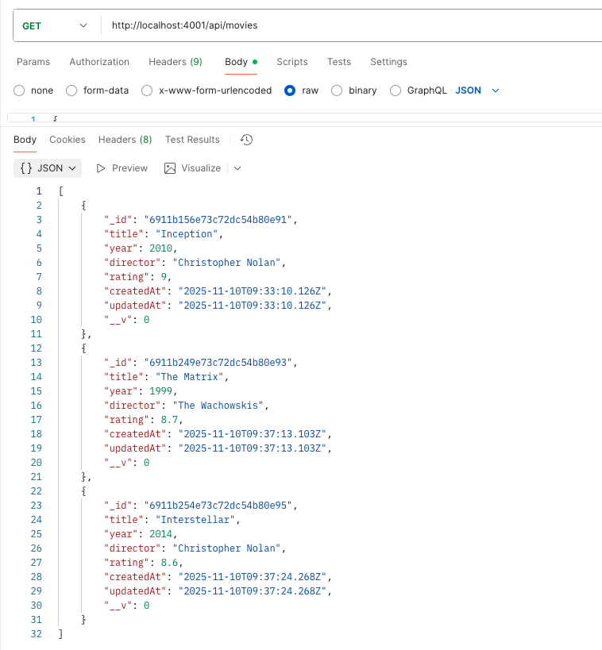
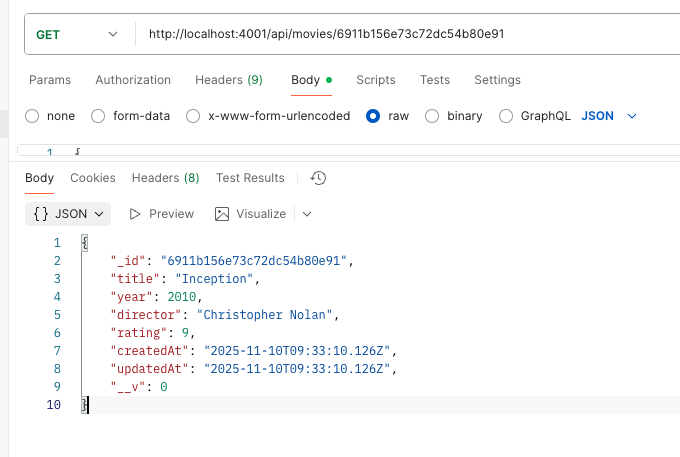
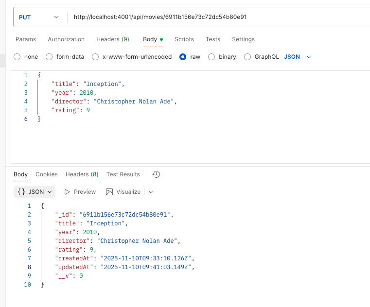

# Building the CRUD API with Mongoose Model

## 🎬 WS-5 Movie API  (full REST API)

A simple RESTful API built with **Node.js**, **Express**, and **MongoDB (Mongoose)** for managing movie data.  
You can **create**, **read**, **update**, and **delete** (CRUD) movies from a MongoDB database.

  
---

## 📁 Project Structure

```bash
ws5-movie-api/
│
├── controllers/
│   └── movieController.js     # Logic for CRUD movie operations
│
├── db/
│   └── db.js                  # MongoDB connection setup
├── img/            
│   ├── Create.png
│   ├── Delete.png
│   ├── GetAll.png
│   ├── GetById.png
│   └── Update.png
│
├── models/
│   └── movieModel.js          # Mongoose schema for Movie
│
├── routes/
│   └── movieRoutes.js         # API route definitions
│
├── .env                       # Environment variables (not included in repo)
├── package-lock.json          
├── package.json               # Dependencies and scripts
├── README.md              # Documentation
└── server.js                  # Main server entry point

```

---

## ⚙️ Prerequisites

Before running the project, ensure you have the following installed:

- [Node.js](https://nodejs.org/) (v18 or later)
- [MongoDB](https://www.mongodb.com/) (local or Atlas)
- [Git](https://git-scm.com/)
- [Postman](https://www.postman.com/) (for testing API endpoints)
- A code editor (e.g., [VS Code](https://code.visualstudio.com/))

---

## 🧩 Installation

### 1. Clone the Repository

```bash
git clone https://github.com/FemiAdesola/WS5-Movie-REST-API.git
cd WS5-Movie-REST-API
```

##  Movie Schema 
```js
// ===== Movie Schema =====
// Define the schema for a Movie document
const movieSchema = new mongoose.Schema(
    {
        title: { type: String, required: true }, // Movie title is required
        year: { type: Number, required: true }, // Release year of the movie is required
        director:{type:String, require: true } , // Director of the movie is required
        rating: Number // Movie rating
    },
    { timestamps: true }
);

```


### 2. Install Dependencies

```bash
npm install
```

---

## 🔐 Environment Variables

This project uses environment variables to manage database connections and configuration.

### Create a `.env` file:

```env
MONGODB_URI=mongodb+srv://<username>:<password>@cluster.mongodb.net/moviedb
PORT=4000
NODE_ENV=development
```

> If you’re using a local MongoDB instance:
> ```
> MONGODB_URI=mongodb://127.0.0.1:27017/moviedb
> ```

---

### 📄 Example `.env.example` file

Include this in your repository for reference:

```env
# Example .env file for WS-5 Movie API

# MongoDB connection URI (replace with your own)
MONGODB_URI=mongodb://127.0.0.1:27017/moviedb

# Server port
PORT=4000

# Environment (development or production)
NODE_ENV=development
```

---

## 🧭 Running the Server

### ▶️ For Mac users

```bash
npm start
```

If MongoDB is running locally, make sure to start it first:

```bash
brew services start mongodb-community
```

Then visit the API at:
* `http://localhost:4000`

---

### ▶️ For Windows users

1. Start MongoDB (if running locally):

   ```bash
   net start MongoDB
   ```

2. Then start the API server:

   ```bash
   npm start
   ```

Your server should now be live at:
* `http://localhost:4001`

---

## 🚀 API Usage

### Base URL
```
http://localhost:4001/api/movies
```

### Available Endpoints

| Method | Endpoint | Description |
|--------|-----------|-------------|
| **GET** | `/api/movies` | Retrieve all movies |
| **GET** | `/api/movies/:id` | Retrieve a single movie by ID |
| **POST** | `/api/movies` | Create a new movie |
| **PUT** | `/api/movies/:id` | Update an existing movie |
| **DELETE** | `/api/movies/:id` | Delete a movie by ID |

---

## Example Requests (using cURL)

### ➕ Create a Movie
```bash
curl -X POST http://localhost:4001/api/movies 
   -H "Content-Type: application/json"
   -d '{
   "title": "Inception", 
   "year": 2010, "director": 
   "Christopher Nolan", 
   "rating": 9
   }'
```

### 📜 Get All Movies
```bash
curl http://localhost:4001/api/movies
```

### 🔍 Get Movie by ID
```bash
curl http://localhost:4001/api/movies/<movie_id>
```

### ✏️ Update a Movie
```bash
curl -X PUT http://localhost:4001/api/movies/<movie_id> -H "Content-Type: application/json" -d '{"rating": 8.5}'
```

### ❌ Delete a Movie
```bash
curl -X DELETE http://localhost:4001/api/movies/<movie_id>
```

---

## 🧭 Postman Examples

To make testing easier, here are some **Postman screenshots** showing example API requests and responses.  
(Replace the image paths with your actual screenshots once captured.)

### 🟢 Create a Movie


### 🟡 Get All Movies


### 🔵 Get Movie by ID


### 🟠 Update Movie


### 🔴 Delete Movie


---

## 🧰 Tech Stack

- **Backend Framework:** Express.js  
- **Database:** MongoDB (Mongoose ODM)  
- **Environment Config:** dotenv  
- **Cross-Origin Handling:** CORS  

---

## 👤 Author

**Femi Adesola Oyinloye**  

---


## 💡 Notes

- Limit of 50 movies is applied when fetching all movies.  
- Errors are handled with appropriate HTTP status codes.  
- Ensure MongoDB is running before starting the API.  
- Replace `<movie_id>` in examples with a valid ObjectId from your database.
